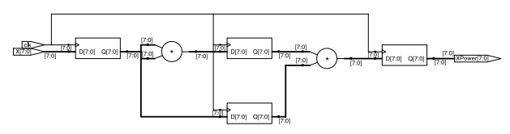
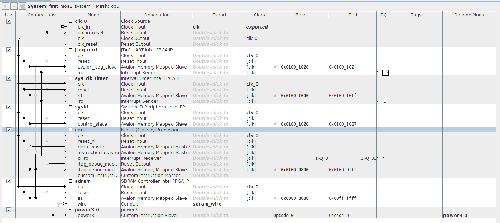
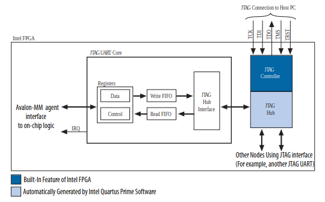
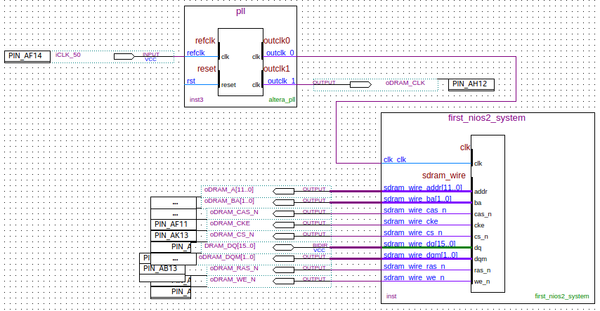

The aim of this project is to create a simple custom instruction slave and
interface it to a NiosII soft-core processor.

## RTL

Out of convenience, a simple slave that calculates the cube of an input was
created. The module `power3.sv` can be found in the rtl sub-repository. It
takes an input `i_x` and calculates its cube in 3 clock cycles. Its schematic is
shown below:

Note: The `i_clkEn` and `i_srst` ports are necessary for the module to be
integrated as a custom instruction slave.

## TB

A simple C++ tb was created. The tb drives the input and after 3 clock cycles
verifies the output against an expected value.

To create the tb, run a simulation and generate waveforms displaying the
signals: `cd tb && make all`.

## FPGA

The Platform Designer tool was used to generate a NiosII processor, include
necessary components, and configure how they connect together. Shown below is a
screenshot of the configured system.

### Clock source

A clock source IP is instantiated. It receives a clock input from the on-board
oscillator and outputs a clock and reset interface used by the rest of the
NiosII system.

### JTAG UART

The JTAG UART core with Avalon interface implements a method to communicate
serial character streams between a host PC and the NiosII processor. The core
provides an Avalon interface that hides the complexities of the JTAG interface
from embedded software programmers. The NiosII processor communicates with the
core by reading and and writing control and data registers.

The JTAG UART core uses the JTAG circuitry built in to Intel FPGAs, and
provides host access via the JTAG pins on the FPGA. For the Nios II processors,
device drivers are provided in the hardware abstraction layer (HAL) system
library, allowing software to access the core using the ANSI C Standard Library
stdio.h routines.

The figure below shows a block diagram of the JTAG UART core and its connection to the JTAG circuitry inside the Intel FPGA.

More info can be found here: https://www.intel.com/content/www/us/en/docs/programmable/683130/21-4/jtag-uart-core.html

### Interval timer

An Interval Timer core with Avalon interface is instantiated for the Nios II
processor system.

The timer was configured as 'Full-featured'. This configuration includes a timer with variable period that can be started and stopped under processor control.

More info can be found here: https://www.intel.com/content/www/us/en/docs/programmable/683130/21-4/interval-timer-core.html

### System ID

The system ID core with Avalon interface is a simple read-only device that provides Platform Designer systems with a unique identifier. Nios II processor
uses the system ID core to verify that an executable program was compiled
targeting the actual hardware image configured in the target FPGA. If the expected ID in the executable does not match the system ID core in the FPGA, it is possible that the software will not execute correctly.

More info can be found here: https://www.intel.com/content/www/us/en/docs/programmable/683130/21-4/system-id-peripheral-core.html

### NiosII/s Processor

A NiosII processor with 2KB instruction cache was instantiated. Hardware multiplication support was not enabled so that the improvement in using a custom instruction slave to calculate the cube of a number was significant.

More info can be found here: https://www.intel.com/content/www/us/en/docs/programmable/683620/current/introduction.html

### SDRAM

The Altera DE1-SOC board contains an SDRAM chip. To interface to the SDRAM chip, an SDRAM Controller IP was instantiated in Platform Designer to make use
of a memory region of 8 MB.

For proper operation of the SDRAM, it is necessary that its clock signal leads
the Nios II system clock by 3 ns to compensate for clock skew (due to the
physical characteristics of the board). This is accomplished by instantiating a PLL from the IP Catalog tab in the .bdf file.

Below is a screenshot of the .bdf file. As shown, a 50MHz reference clock is
provided as input and two clocks are output at the same frequency but with a
phase difference.

More info can be found here: https://www.intel.com/content/www/us/en/docs/programmable/683130/21-4/sdram-controller-core.html

### Power3

The power3 module was instantiated as a custom instruction slave using Platform
Designer and its ports interfaced to the NIosII processors's custom instruction
master interface.

MOre info on creating a custom instruction slave can be found here: https://www.google.com/url?sa=t&rct=j&q=&esrc=s&source=web&cd=&cad=rja&uact=8&ved=2ahUKEwikxci4p7yEAxV7QEEAHQwKCvMQFnoECBEQAQ&url=https%3A%2F%2Fcdrdv2-public.intel.com%2F666927%2Fug_nios2_custom_instruction-683242-666927.pdf&usg=AOvVaw3pag7AvEcMGD2aE0cWhAt3&opi=89978449

Note: A step-by-step guide to instantiating all the modules can be found in
`../DSDCoursework/coursework.pdf`.

## Software

A Hello World template NiosII application and BSP was created using the Eclipse
IDE. The hello_world.c program generated was replaced by the code in
`/fpga/software/power3/hello_world.c`. The code measures the time taken for the
processor to calculate the cube of a number in software by emulating fixed point
additions and the time taken using the custom instruction slave.

Note: Remember to add the interval timer to your timestamp timer settings in
the BSP.
